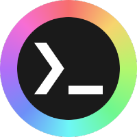

<h2 align=center>Unixporn-dots</h2>

<div align=center>
 <br>
A collection of dotfiles from the r/unixporn community
<br>
<a href="https://unixporn-dots.github.io">Visit Site</a>
</div>

---
<br>

# Add your Dotfiles
+ Opening a pull request:
  1. Fork this repository.
  2. Add your entry in the `dotfiles.json` file.
  3. The image can be added via a url, or by adding an image inside the `assets` folder and referencing it.
  4. Open a pull request and it's done!

<br>

+ Through an Issue:
    1. Use the template provided and fill in the necessary details
    2. Open an Issue and you're done!

```js
{
    title: 'Dotfiles',
    author: 'Armoredvortex',
    link: "https://github.com/armoredvortex",
    reddit: 'https://reddit.com/r/unixporn/comments/abcdef/my_dotfiles',
    description: 'My dotfiles',
    image: 'assets/bridge.png',
    wm: 'xmonad',
    tags: ['xmonad', 'polybar']
}
```
NOTE: Please try to make sure the image has a 16:9 aspect ratio for consistency
